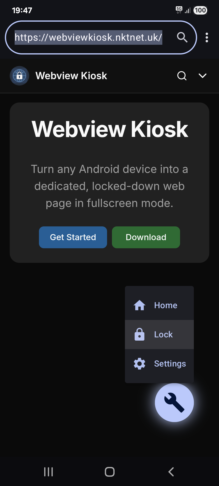
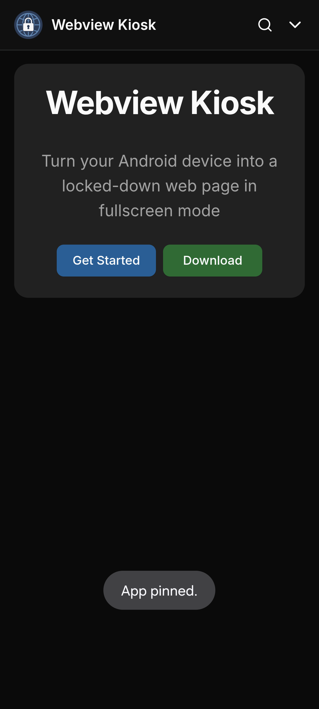
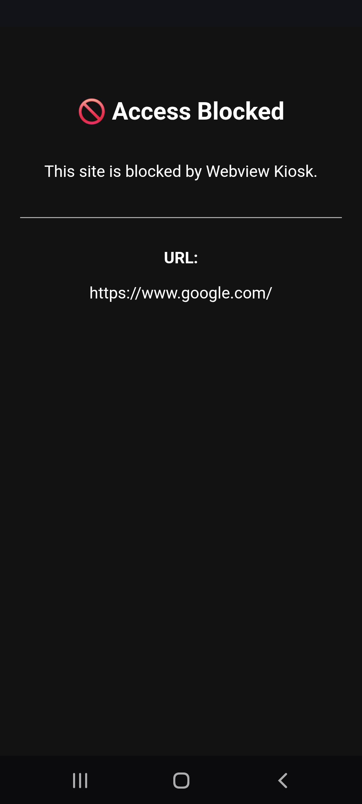
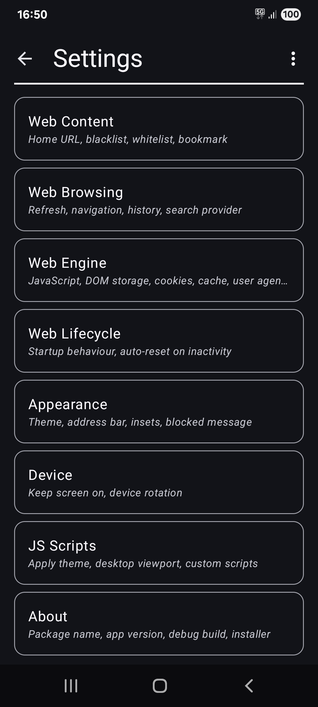

> [!WARNING]
>
> Google's new developer verification requirements for 2026-2027 will
> mean the end for side-loading and many alternate stores and projects
> such as F-Droid and New Pipe.
> 
> For more information, please refer to the following sources:
> 
> - F-Droid: https://f-droid.org/2025/09/29/google-developer-registration-decree.html
> - Video context: https://www.youtube.com/watch?v=wRvqdLsnsKY
> - Actions you can take: https://www.reddit.com/r/androiddev/comments/1nc0p8o/collection_of_actions_that_can_be_done_regarding

# Webview Kiosk

> Docs: https://webviewkiosk.nktnet.uk

Webview Kiosk is a free and open-source Android application for secure,
kiosk-style web browsing.

The app is designed for small businesses and device owners who are looking for
a simpler alternative to Enterprise Mobility Management (EMM) or Mobile Device
Management (MDM) systems.

## Key Features

- **Lock Task Mode (Pin):** prevent users from opening other apps or accessing the
  status bar. You can also enable the "Lock device when unpinning" android feature to
  further enhance security
- **Protected Settings:** protect app settings with biometrics or device credentials
- **URL Filtering:** supports regex-based blacklist and whitelist to control web access
- **Export/Import:** allow for backups of settings & configurations

## Installation Notes

From [v0.17.0](https://github.com/nktnet1/webview-kiosk/releases/tag/v0.17.0),
Google Play's [automatic protection](https://support.google.com/googleplay/android-developer/answer/10183279)
has been intentionally **disabled** to allow installations from the Aurora Store.

From [v0.15.7](https://github.com/nktnet1/webview-kiosk/releases/tag/v0.15.7),
the package name for all installation sources except the Google Play Store has
changed from `com.nktnet.webview_kiosk` to `uk.nktnet.webviewkiosk`.

## Contact

- support@webviewkiosk.nktnet.uk

## License

This project is licensed under the GNU Affero General Public License v3.0 or later.

See the [LICENSE](./LICENSE) file for details.

## Screenshots

  &nbsp;
  &nbsp;
  &nbsp;
  

